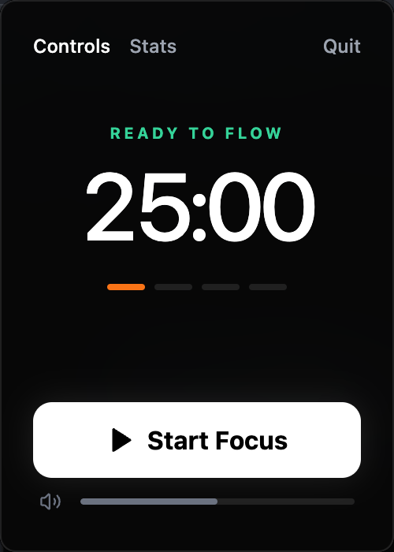
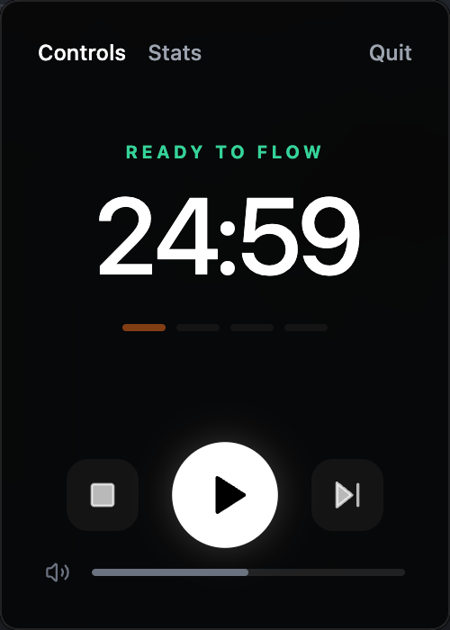
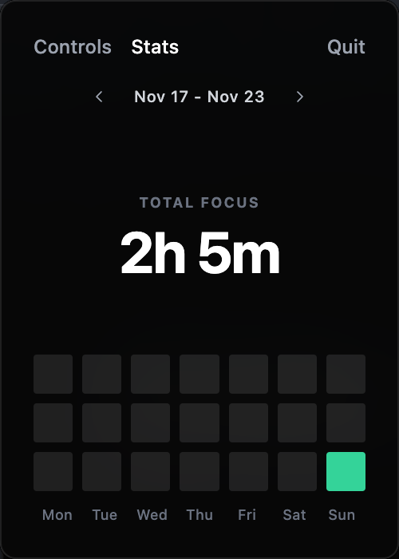
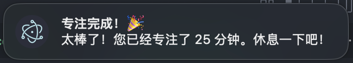

---
# **🚀 Focus App — macOS Menu Bar Timer**

### *A Minimalist, Elegant Focus Timer for macOS*

### *一个极简、优雅的 macOS 菜单栏专注计时器*
---
<p align="center">
  
  
  
</p>

---

## 📌 **Introduction | 介绍**


<p align="center">
  
</p>


**Focus App** 是一个专为 macOS 设计的菜单栏专注计时器（番茄钟），具备极简界面与平滑交互体验，实现 **专注计时 + 白噪音 + 数据统计** 于一体。

A lightweight macOS menubar app providing **focus timer + white noise + statistics visualization** with a clean UI.

---

## 💡 **Credits | 致谢**

本项目创意来自于小红书用户 **“卡夫卡”**（ID: 174973146）。
This project is inspired by Xiaohongshu user **“Kafka”** (ID: 174973146).

---

## 📸 **Preview | 预览**

<p align="center">
  
  
  
  
</p>

---

## ✨ **Features | 功能特性**

### 🖥️ **Menubar Resident | 菜单栏驻留**

* Quietly lives in macOS menu bar
* Click to open, click outside to close
* 安静驻留菜单栏，点击外部自动隐藏

### 🎨 **Native macOS Glass UI | 原生毛玻璃界面**

* Always-on-top
* Borderless window
* Glassmorphism
* 毛玻璃效果、无边框、始终置顶

### ⏳ **Focus Timer | 专注计时**

* Countdown with pause / resume / skip
* 倒计时，支持暂停 / 继续 / 跳过

### 🌧️ **Built-in White Noise | 内置白噪音**

* High-quality rain sounds
* Independent volume controls
* 独立音量控制、可静音

### 📊 **Data Statistics | 数据统计**

* Interactive weekly heatmap
* Real-time focus duration
* Local persistent storage
* 交互式热力图、实时记录、本地历史存储

### ✨ **Elegant Interaction | 优雅交互**

* Smooth tab transitions
* Rounded UI
* 丝滑 Tab 切换、圆润界面

---

## 🛠️ **Tech Stack | 技术栈**

| Category       | Tools                      |
| -------------- | -------------------------- |
| Core Framework | **Electron**         |
| Frontend       | **React + Vite**     |
| Styling        | **Tailwind CSS**     |
| Icons          | **Lucide React**     |
| Build          | **electron-builder** |

---

## 🚀 **Getting Started | 快速开始**

### ✔️ **Prerequisites | 环境要求**

* macOS
* Node.js ≥ 16
* npm / yarn

---

### **1. Install Dependencies | 安装依赖**

```bash
cd focus-app
npm install
```

> 建议使用淘宝镜像加速 Electron 下载。

---

### **2. Run in Development Mode | 开发模式运行**

```bash
npm run electron:dev
```

> 开发模式下图标可能出现在 Dock 中用于调试。

---

### **3. Build App | 打包构建**

```bash
npm run electron:build
```

生成 `.dmg` 安装包，位于 **dist/** 目录。

---

## 📂 **Project Structure | 项目结构**

```
focus-app/
├── dist/               # 构建输出目录
├── public/
│   └── TrayIcon.png    # 菜单栏图标
├── src/
│   ├── App.jsx         # 主界面与逻辑
│   ├── index.jsx       # 前端入口
│   └── styles.css      # 全局样式
├── index.html          # Web 入口
├── main.js             # Electron 主进程
├── package.json        # 项目配置
└── tailwind.config.js  # Tailwind 配置
```

---

## ⚠️ **Troubleshooting | 常见问题**

### 🖼️ 图标大小不正确？

请确保 `public/TrayIcon.png` 存在。应用已内置自动缩放逻辑。

### ❌ 无法退出程序？

点击右上角 **Quit** 按钮即可完全退出。
`Cmd + W` 只是隐藏窗口，不会退出进程。

---

## 📄 **License | 许可证**

**MIT License**

---
